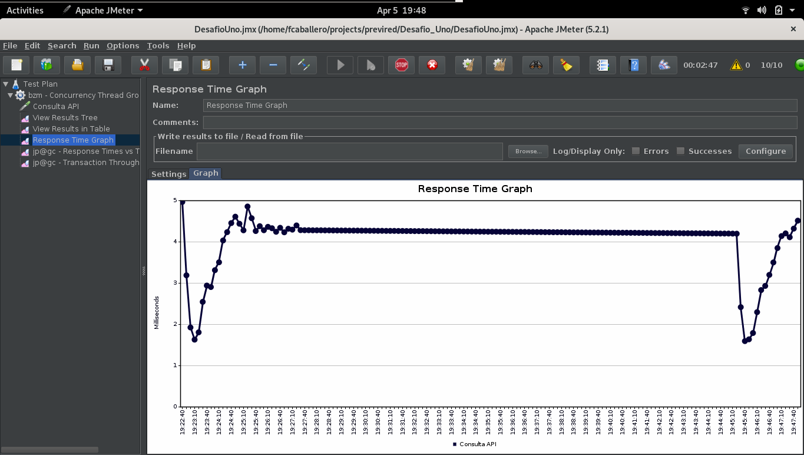
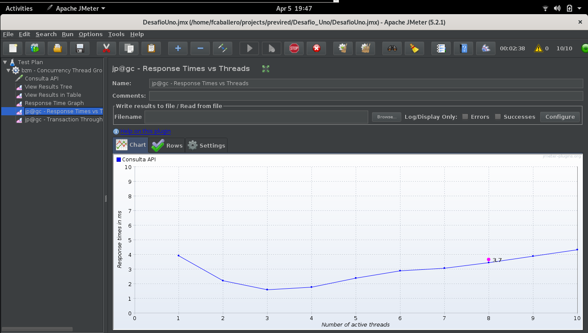
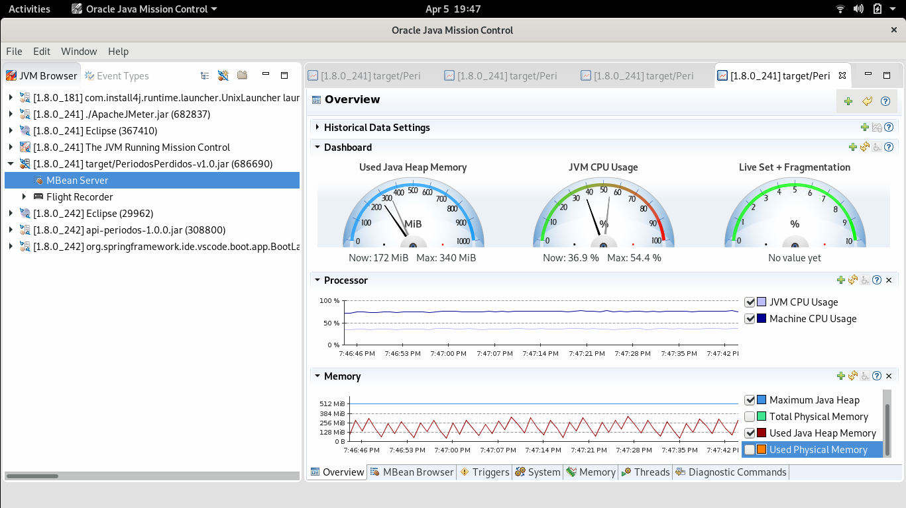

Datos personales
====

Dato | valor 
-----|------
|Nombre Completo | Felipe Alfonso Caballero Salas|
|Email| felipe.caballero.s@gmail.com|
|Teléfono| +56997232923|
|Vía por la que se enteró del desafío| Empresa de Outsourcing (Tech Consult, Leonardo Miranda).|

Requisitos
===
- Java Version "1.8.0_241"

Compilación
===

La compilación requiere la instalación, de Apache Maven.

Se debe realizar vía el siguiente comando

```shell
# Variables de entorno necesarias para el compilador
$ export JAVA_HOME=<la ubicacion de su JAVA_HOME>

# Instalación del producto
$ ./mvnw install

```

Luego del paso anterior. en el directorio /target aparecerá un archivo llamado **PeriodosPerdidos-v1.0.jar**

Ejecución
===
```shell
# Variables de entorno necesarias para el compilador
$ export JAVA_HOME=<la ubicacion de su JAVA_HOME>

# Ejecución
$ $JAVA_HOME/bin/java -Xms512M -Xmx512M -XX:+UseG1GC -XX:+PrintGCDetails -Xloggc:target/PeriodosPerdidos-gc.log -XX:+HeapDumpOnOutOfMemoryError -XX:HeapDumpPath=target/PeriodosPerdidos.hprof -jar target/PeriodosPerdidos-v1.0.jar

# Finalizacion del programa
$ <CTRL + z>
```
Documentación
===
http://127.0.0.1:8081/swagger-ui.html#/

Importante
====
- La implementación cuenta con control via Hystrix que asegura en control ante la indisponibilidad del backend.
- El componente fue probado con una carga maxima de 10 TPS lo cual se considera suficiente para efectos de demo.
- Podria mejorar la performance con mas configuraciones que no fue posible implementar dado el tiempo.

Resultados de las pruebas de carga
===
Response Time
---
Durante la carga se puede observar una minima variación entre 1 [ms] y 5 [ms]. La prueba se ejecutó en un equipo con sistema operativo Fedora 31, CPU Intel Core i7 (8th gen) y 32 Gb de Memoria RAM.



Throughput vs Threads
---
Se registró una media de 2874.7 [TPS] generada por 10 threads concurrentes.


Response Time vs Threads
---
En este gráfico se puede ver la correlación entre threads vs tiempo de respuesta, y se puede observar que para la carga testeada se dibuja una curva es ascendente en una proporcion inferior a 1 y muy cercana al 0.5



Java Mission Control
---
En esta ultima imagen se puede observar el comportamiento del procesador y de la memoria.
Por el lado de la CPU, la utilización de la JVM se marca en un 39.9% constante, registrando un máximo de 54.4% en la partida.
Por el lado de la memoria JAVA, se registra un maximo de 340 [Mb] con ciclos de valle inferior a 128 [Mb]. Para la JVM se definió un maximo de 512 [Mb] (Xms y Xmx) con un garbage collector G1 de ultima generación.
En la curva de memoria se puede observar una forma de cerrucho que para una aplicación Java indica un correcto tunning de JVM.

