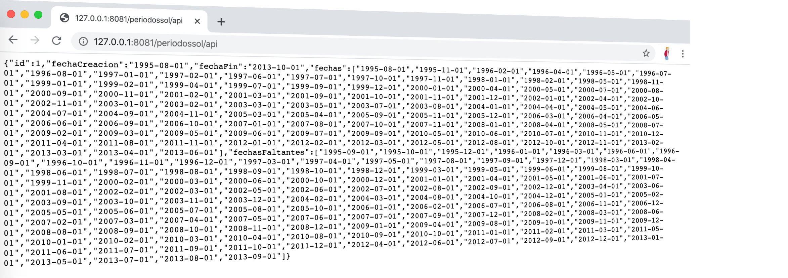

# [Marcelino Cerna] Solución a desafío 1, nivel 3 (WS -> WS)

Este proyecto expone un API REST que verifica el resultado del servicio generador de datos (GDD), registrando aquellas fechas que no existen.

# Tecnología/Herramientas usadas

Swagger Codegen 2.3.1 (OpenApi 2.0)
Java 8
Spring-Boot 1.5.11.RELEASE
Maven 3


# Compilar y ejecutar el proyecto

Para copilar el proyecto se requiere Java y Maven instalado.
Ingresar al directorio **ApiPeriodosSolucion** ejecutar el siguiente comando *maven*

```bash
# desde ApiPeriodosSolucion
mvn package
```

Luego de compilar el proyecto ingresar al directorio **target**, ejecutar el siguiente comando *java*

**Consideraciones adicionales.**
- [x] Servicio GDD debe estar corriendo en máquina local puerto 8080 

```bash
# tomcat correra en puerto 8081, favor asegurar que este disponible en su pc
java -jar api-periodos-sol-1.0.0.jar
```


# Visualizar Documentación y consumir la API

La documentación swagger del API (una vez que se levanta el API) queda disponible en

http://127.0.0.1:8081/periodossol/swagger-ui.html#/

Para consumir el servicio se debe invocar la siguiente URL

```bash
curl -X GET --header 'Accept: application/json' 'http://127.0.0.1:8081/periodossol/api'
```
o desde el navegador (http://127.0.0.1:8081/periodossol/api)


## Para requerimiento: "Junto con la solución debes entregar un archivo con la entrada y con la salida en formato JSON"
*archivo generado*
```bash
archivo_entrada_salida.txt
```

---
---
## Información de Servicio Generador (información de entrada al "WS solución")
*id*: identificador
*fechaCreacion*: Fecha de inicio de la secuencia
*fechaFin*: Fecha de fin de la secuencia
*fechas*: Lista de fechas que están en el rango de la fecha que se encuentra en “fechaCreacion” hasta la fecha “fechaFin”
Ejemplo.
```json
{
    "id": 6,
    "fechaCreacion": "1968-08-01",
    "fechaFin": "1971-06-01",
    "fechas": [
      "1969-03-01",
      "1969-05-01",
      "1969-09-01",
      "1971-05-01"]
}
```
*Nota*:
El formato de las fechas es yyyy-MM-dd
El servicio entrega 1 periodos, el periodo contiene una fecha inicial una fecha final y una lista fechas.
## Información de Salida "Servicio Solución".

Genera una salida con las fechas del Servicio Generador y las fechas faltantes

```json
{
    "id": 6,
    "fechaCreacion": "1969-03-01",
    "fechaFin": "1970-01-01",
    "fechas": [
      "1969-03-01",
      "1969-05-01",
      "1969-09-01",
      "1970-01-01"],
    "fechasFaltantes": [
      "1969-04-01",
      "1969-06-01",
      "1969-07-01",
      "1969-08-01",
      "1969-10-01",
      "1969-11-01",
      "1969-12-01"]

}
```


# Regenerar API Solución a partir de yaml

Las siguientes instrucciones solo son para re-escribir el API si es necesario agregar una nueva funcionalidad a partir del *YAML*.

Bajar SwaggerCodeGen 2.3.1 en la raíz del proyecto, ejecutando el siguiente comando por consola.

```bash
wget http://oss.sonatype.org/content/repositories/releases/io/swagger/swagger-codegen-cli/2.3.1/swagger-codegen-cli-2.3.1.jar -O swagger-codegen-cli.jar
```

Para re-crear el código a partir de la definición del *YAML* de swagger ejecutar el siguiente comando

```bash
java -jar ./swagger-codegen-cli.jar generate -i ./swagger/periodos.yaml -l spring -c ./swagger/config.json -o ApiPeriodosSolucion --ignore-file-override ./.swagger-codegen-ignore
```

*Nota*:
Esto creara toda la estructura de swagger y re-escribirá todas las clases que no estén declaradas en el archivo *.swagger-codegen-ignore*

